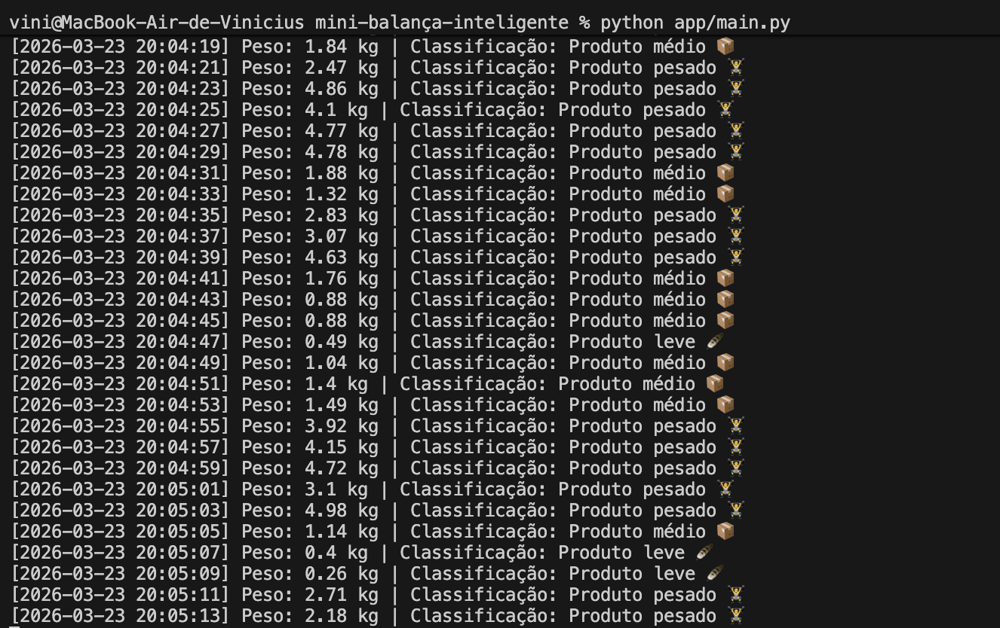

# 🧠 Mini Balança Inteligente

> Sistema em Python que simula uma balança inteligente capaz de ler pesos e classificar produtos automaticamente com base em regras de negócio.



---

## 🚀 Sobre o projeto

Este projeto simula o comportamento de um sistema embarcado, focando em boas práticas de desenvolvimento e organização de código. O objetivo é demonstrar como um fluxo de dados de sensores pode ser processado e classificado de forma modular.

**Conceitos aplicados:**
* **Arquitetura Modular:** Código dividido em componentes independentes.
* **Separação de Responsabilidades:** Cada módulo possui uma função única e clara.
* **Simulação de Sensores:** Lógica para entrada de dados dinâmicos.
* **Processamento em Tempo Real:** Resposta imediata à variação de dados.

---

## 🧩 Arquitetura do Sistema

O software é estruturado em camadas para facilitar a manutenção e escalabilidade:

* **`Sensor`** (app/sensor.py): Responsável pela captura e simulação da leitura do peso.
* **`Classifier`** (app/classifier.py): Contém o "cérebro" do sistema, aplicando as regras de identificação.
* **`Utils`** (app/utils.py): Funções auxiliares para formatação e exibição de dados.
* **`Main`** (app/main.py): Ponto de entrada que orquestra todo o fluxo da aplicação.

---

## ⚙️ Tecnologias e Requisitos

* **Linguagem:** Python 3.x
* **Dependências:** Verifique o arquivo `requirements.txt`

---

## ▶️ Como executar

1. **Clone o repositório:**
   ```bash
   git clone [https://github.com/Vincostta/mini-balanca-inteligente](https://github.com/Vincostta/mini-balanca-inteligente)
   cd mini-balanca-inteligente